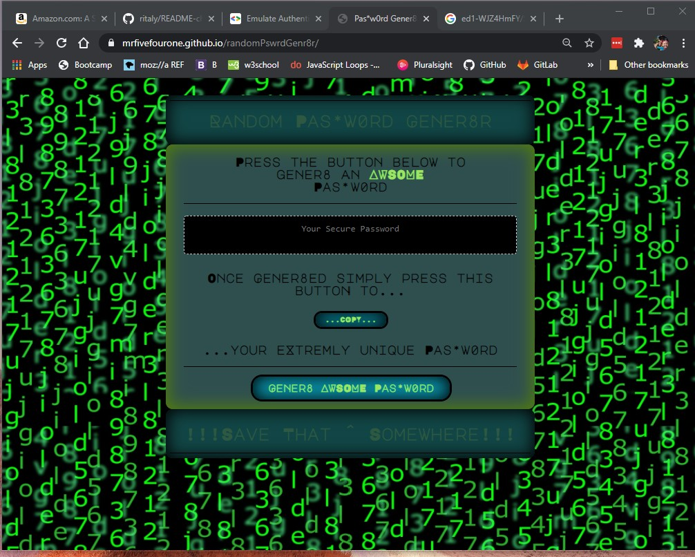
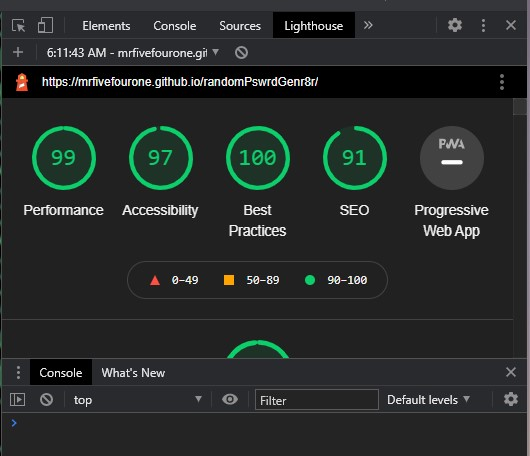

# randomPas*w0rdGener8r

I wanted to create an application that can generate a random password based on criteria the user will select there will be five main critera;

1. Password must be atleast 8 characters long, but not to exceed 128, and it also must be ABLE to, but not HAVE to include; 
2. Upper Characters, 
3. Lower Characters,
4. Special Characters,
5. and lastly Numbers.

This app will be browser reliant, consist of bare bones HTML, as it will be dynamically updated via JavaScript, and of course CSS. Ofcousre it will be mobile friendly and have a polished finish.

## Table of contents
* [General info](#general-info)
* [Screenshots](#screenshots)
* [Links](#links)
* [Setup](#setup)
* [Features](#features)
* [Status](#status)
* [Inspiration](#inspiration)
* [Contact](#contact)

## General info

The user is promted to choose the Character Lenght from the start, and if the user input is outside the give parameters they are alereted of that fact and must restart. 

Once that is validated the user then goes through a series of four promts asking bolean questions regarding their prefrence on the variety of Characters and Numbers they would like in thier new password.

Again, once that is valadated, a loop runs through all thier selections and randomly picks whatever Characters they chose and displays it in the black box in the middle of the screen.

I built in a handy little 'COPY' button that will copy the displayed Password to your clipboard for you.

Initialy, I built this in a hurry and not fully understanding how to accomplish it, then went back once I fully understood and finished it. There will be screenshots of both versions.  
## Screenshots

Finished Product

First Try

## Links

* [URL of live site](https://mrfivefourone.github.io/randomPswrdGenr8r/)

* [First Readme](https://github.com/MrFIVEfourONE/randomPswrdGenr8r/blob/main/README.md)

## Setup
Browser Based

## Code Examples
I am especialy proud of the Copy function:

`function copyPassword() {
    var copyText = document.querySelector("#password");
    copyText.select();
    document.execCommand("copy");
  }
  

copyBtn.addEventListener("click", copyPassword);`

## Features

* It got an almost perfect score with Dev Tool Lighthouse

* Ability to copy Password to clipboard.

## Status
Project is: finished.

## Inspiration

Malgorzata Rita : for providing this awsome readme format! [@flynerdpl](https://www.flynerd.pl/)

Dane Shrewsbury : for being a mentor and helping with some last minute JavaScript bugs.

## Contact
choffman541@gmail.com feel free to contact me.