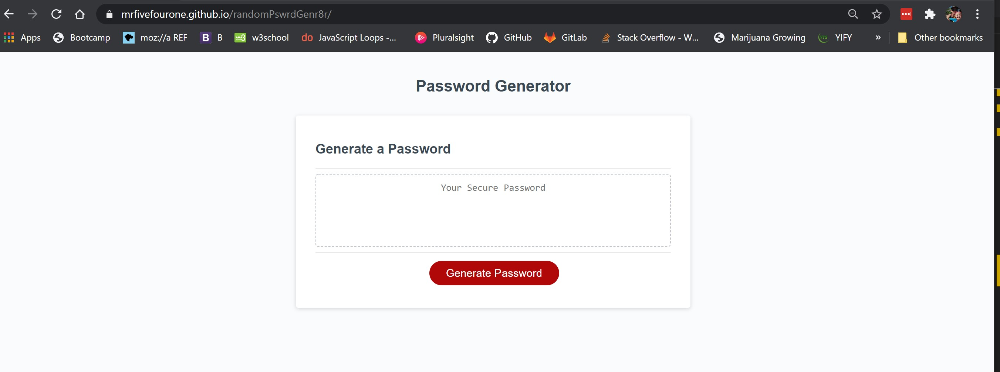
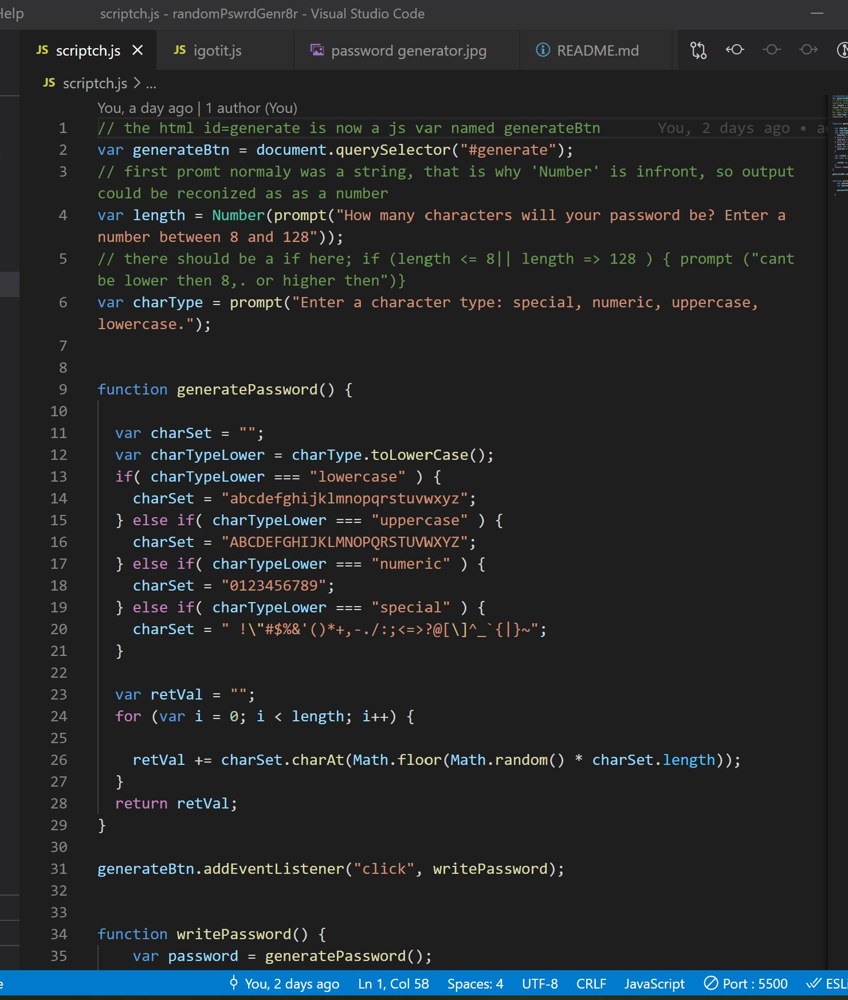

# randomPswrdGenr8r

all credit to the functionality of this password generator goes to my instructer. I take no credit for building this elegant piece of code. I did however spend atleast 12 hours on this and still just to get to this point. The amount of effort i put into this is not reflected yet with the finished product as i spent most the time stumbling over myself, googleing, cut, copy and past...ing and getting no where near with what the assignment was requesting.... 

I almost gave up, still feel like i should, but i wont. Im going to fake it until i make it, 

notice there is three .js files:
one (scriptch.js) is my first attempt and the 
second (igotit.js) is the result of me disecting a recorded video of class.
third (script.js) is what was provided

the second one igotit.js is the script you will see on the deployed site.

Site:

Site URL: https://mrfivefourone.github.io/randomPswrdGenr8r/

Provided Script:

1st attempt:

Deployed Script:

and again i feel like 1000% imposter right now.

i didnt have time to make it pretty, it is a basic utility of a site, not much to remember.

i WILL do justice by this as i get better and understand what im doing... and find the time to come back here and make it my own. This was primarily a learning process for me. I had some epiphanies immediately followed by a broken brain once again. 

